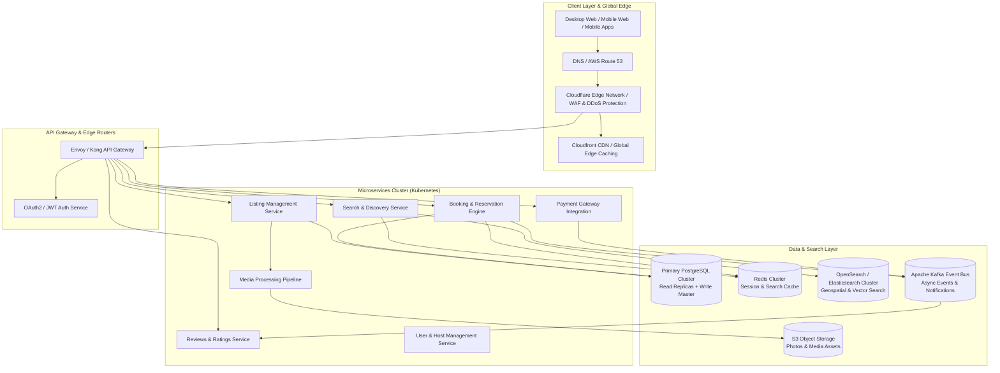

# Production-Scale Vacation Rental Marketplace Architecture

This document describes the high-level architecture and scaling strategy for a production-scale vacation-rental marketplace (e.g., Airbnb) engineered to handle millions of active listings, real-time availability searches, high-concurrency booking reservations, and global media streaming.

---

## High-Level Architecture Diagram

---

## 1. Edge & Frontend Strategy
- **Framework & SSR:** Next.js / React 18 with Server-Side Rendering (SSR) and Incremental Static Regeneration (ISR) for static listing pages to ensure instant initial page load times and optimal SEO.
- **Global CDN & Edge Caching:** Static assets, optimized WebP/AVIF property images, and pre-rendered listing HTML pages are cached globally across 300+ Edge POPs via Cloudflare / AWS CloudFront.
- **Dynamic Feature Hydration:** Static shell renders immediately from Edge CDN while dynamic widgets (live pricing, date availability, wishlist state) hydrate on the client via lightweight GraphQL/REST APIs.

---

## 2. Microservices Architecture
- **Search & Discovery Service:** Powered by Elasticsearch / OpenSearch cluster with geospatial indexing (`geo_bounding_box`, `geo_distance`), autocomplete, and neural embedding vector search for personalized recommendation rankings.
- **Booking & Reservation Engine:** Implements optimistic concurrency control and distributed locks via Redis (`Redlock` algorithm) to eliminate double-booking during peak reservation traffic.
- **Media Pipeline:** Asynchronous image processing worker pool (using AWS Lambda / S3 Event notifications) that auto-generates responsive image srcsets, watermarks, and smart thumbnail crops.

---

## 3. Data & Storage Layer
- **Relational Data (PostgreSQL):** Transactional data (user accounts, listing metadata, reservations, host payouts) stored in Multi-AZ PostgreSQL with active read-replicas for load distribution.
- **In-Memory Caching (Redis):** Distributed Redis cluster caching listing details, seasonal rate rules, active user sessions, and rate-limiting quotas.
- **Event Streaming (Kafka):** Distributed message bus publishing domain events (`ReservationCreated`, `PaymentCompleted`, `ReviewSubmitted`) consumed asynchronously by notification and analytics services.

---

## 4. Multi-Region Scaling & Reliability
- **Kubernetes Auto-scaling:** Pod Auto-scaling (HPA) automatically scales application pods based on CPU utilization and request queues.
- **Disaster Recovery:** Multi-region active-passive setup with continuous automated database replication and automated failover routing via AWS Route 53 latency routing policies.
